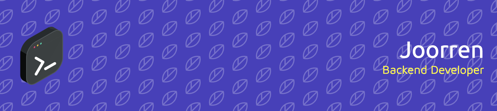

  <ul align="center" style="list-style: none">
    

      <h1>
        👋 Hi, my name is Joren
      </h1>
    

  </ul>

&nbsp;

**<h3 align="center">Find me on</h3>** 

 

&nbsp;

 **<h3 align="center">My skills</h3>**

       

&nbsp;

 **<h3 align="center">My GitHub Stats</h3>**

  
  

